# 🦉 How Edwin Works

Edwin is a TypeScript library that serves as the bridge between AI agents and DeFi protocols. It provides a unified, secure interface for AI agents to interact with various DeFi protocols while abstracting away the complexity of blockchain operations and protocol-specific implementations.

## System Architecture

```mermaid
graph TB
    %% Styling
    classDef highlight fill:#e1f5fe,stroke:#01579b,stroke-width:2px
    classDef core fill:#e8f5e9,stroke:#2e7d32,stroke-width:2px
    classDef security fill:#ffebee,stroke:#c62828,stroke-width:2px

    subgraph "AI Layer"
        A[AI Agent]
        P[Edwin Plugin]
        A --> P
    end
    
    subgraph "Edwin - DeFAI Layer"
        B[Framework Adapter]
        C[Protocol Abstraction Layer]
        
        P --> B
        B --> C
        
        subgraph "Security Layer"
            F[Transaction Validation]
            G[Protocol Whitelist]
            H[Security Checks]
        end
    end
    
    subgraph "Protocol Layer"
        I[Protocol SDKs]
        J[DeFi Protocols]
        
        C --> I
        I --> J
    end
    
    %% Security connections
    F -.-> C
    G -.-> C
    H -.-> C

    %% Apply styles
    class A,P highlight
    class B,C core
    class F,G,H security
```

## Core Components

### Protocol Abstraction Layer

The heart of Edwin is its Protocol Abstraction Layer, which provides a standardized interface for interacting with different types of DeFi protocols:

* **Lending Protocols**: Standardized interfaces for lending and borrowing operations
* **DEX Protocols**: Unified interfaces for liquidity provision and trading
* **Future Protocol Types**: Extensible system for adding new protocol categories

### AI Framework Adapters

Edwin's framework adapters enable seamless integration with AI frameworks:

* Standardized command interface
* State and context management
* Response formatting
* Error handling

### Security Layer

Edwin incorporates multiple security measures to ensure safe DeFi operations:

1. **Transaction Security**
   * Transaction validation and signing
   * Amount and gas limits
   * Slippage protection
   * Failure recovery
2. **Protocol Security**
   * Whitelist verification
   * Protocol health checks
   * Operation boundaries
   * Risk assessment

## Data Flow

### 1. Command Initiation

* AI agent generates a DeFi operation command
* Framework adapter normalizes the command for Edwin

### 2. Protocol Abstraction

* Command is mapped to standardized protocol interface
* Protocol type is identified (Lending, DEX, etc.)
* Operation is validated against protocol interface

### 3. Security Checks

* Transaction validation
* Protocol whitelist verification
* Security boundaries check

### 4. Protocol Execution

* Protocol interface executes operation through SDK
* Transaction is signed and broadcast
* Result is monitored and returned

## Integration Points

### For AI Frameworks

Edwin provides a clean adapter interface that:

* Accepts standardized commands
* Handles response formatting
* Manages state updates
* Provides operation feedback

### For DeFi Protocols

Protocols can integrate with Edwin through:

* Implementation of protocol type interfaces
* SDK integration

## Technical Implementation

Edwin is an open-source TypeScript library that enables:

* Extensibility to all protocols
* Easy integration with existing frameworks
* Community driven development
