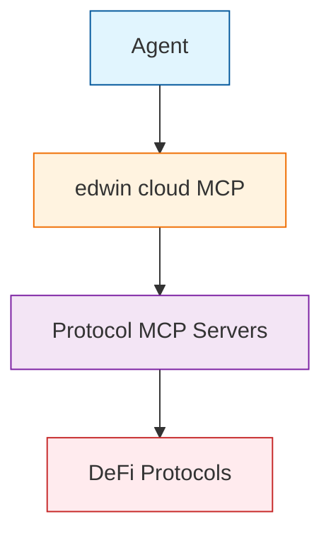

# Architecture

## MCP Server Network

edwin cloud operates as a distributed network of MCP servers:

* **Central MCP Server**: Routes requests to protocol-specific MCP servers
* **Protocol MCP Servers**: Handle protocol-specific transaction construction, execution, and context understanding
* **edwin-client SDK**: Integrated into the agent, providing secure communication with edwin cloud

## edwin Protocol

The edwin Protocol enables secure communication between the client and server:

### Client-Side Components
* **Wallet Management**
  * Secure key storage
  * Key derivation
  * Address management
* **Transaction Signing**
  * Signature generation
  * Signature verification
  * Multi-signature support
* **Request Formatting**
  * Protocol-specific formatting
  * Parameter validation
  * Error handling

### Server-Side Components
* **Transaction Construction**
  * Protocol-specific transaction building
  * Parameter optimization
  * Gas estimation
* **Transaction Execution**
  * Network submission
  * Confirmation monitoring
  * Receipt handling
* **Context Understanding**
  * Protocol state analysis
  * Market condition assessment
  * Risk evaluation
* **Protocol Routing**
  * Load balancing
  * Failover handling
  * Protocol selection
* **Error Handling**
  * Automatic retries
  * Error classification
  * Recovery strategies

## Security Architecture

### Client-Side Security
* **Private Key Protection**
  * Keys never leave the client
  * Local signature generation
  * Secure key storage
  * Hardware wallet support

* **Request Security**
  * Request signing
  * Parameter validation
  * Rate limiting
  * Input sanitization

* **Communication Security**
  * TLS encryption
  * Request signing
  * API key validation
  * Session management

### Server-Side Security
* **Infrastructure Security**
  * Cloud security best practices
  * Network isolation
  * Access control
  * Monitoring and logging

* **Application Security**
  * Input validation
  * Output sanitization
  * Error handling
  * Rate limiting

* **Data Security**
  * Encryption at rest
  * Encryption in transit
  * Access control
  * Data retention 