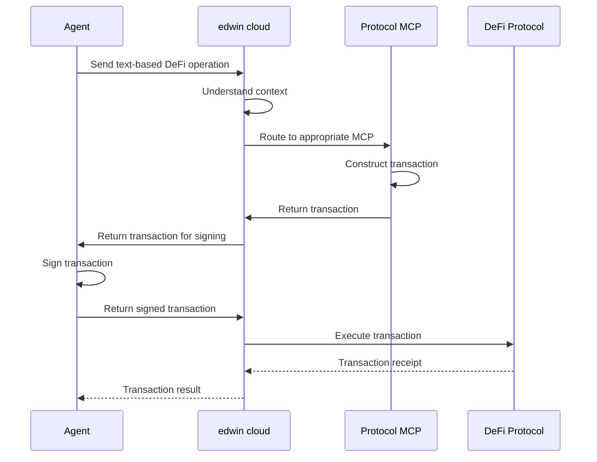

# Transaction Flow

## Overview

edwin cloud handles the complete transaction lifecycle, from construction to execution, while maintaining client-side security. The agent only needs to provide the DeFi operation in text form and sign the transaction.

## Flow Diagram

## Process Details

### 1. Operation Submission
* Agent sends text-based DeFi operation
* Operation includes:
  * Protocol identifier
  * Operation type
  * Parameters
  * User context

### 2. Context Understanding
* edwin cloud analyzes:
  * Protocol state
  * Market conditions
  * Risk factors
  * User preferences
* Optimizes transaction parameters
* Determines best execution strategy

### 3. Protocol Routing
* edwin cloud identifies appropriate Protocol MCP
* Routes request with context
* Handles protocol-specific requirements
* Manages protocol state

### 4. Transaction Construction
* Protocol MCP constructs transaction
* Includes:
  * Protocol-specific parameters
  * Gas estimation
  * Nonce management
  * Deadline settings

### 5. Transaction Signing
* Transaction returned to agent
* Agent signs locally
* Signature verification
* Multi-signature support

### 6. Transaction Execution
* edwin cloud submits to DeFi protocol
* Monitors confirmation
* Handles failures
* Returns result

## Security Measures

### Client-Side Security
* Private keys never leave agent
* Local signature generation
* Secure key storage
* Hardware wallet support

### Server-Side Security
* Request validation
* Parameter sanitization
* Rate limiting
* Protocol whitelisting

### Network Security
* TLS encryption
* Request signing
* API key validation
* Session management

## Error Handling

### Transaction Failures
* Automatic retry logic
* Error classification
* Recovery strategies
* Status monitoring

### Network Issues
* Connection retry
* Timeout handling
* Load balancing
* Failover support

## Transaction Monitoring

### Status Tracking
* Transaction state
* Confirmation status
* Gas usage
* Block inclusion

### Error Tracking
* Failure reasons
* Retry attempts
* Recovery actions
* Error patterns

## Transaction Analytics

### Performance Metrics
* Success rate
* Failure rate
* Average time
* Gas efficiency

### Error Analysis
* Common failures
* Recovery success
* Pattern detection
* Improvement areas 