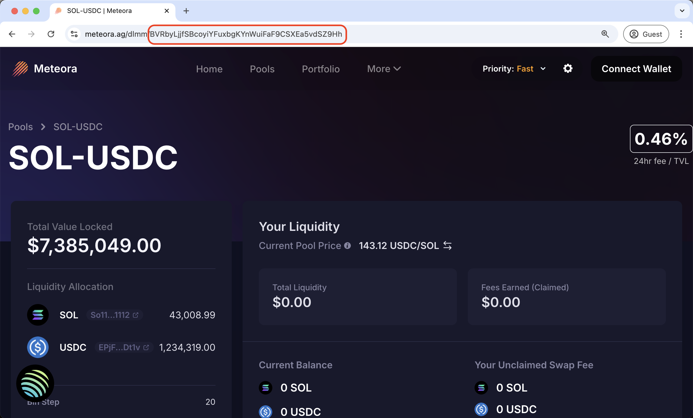

# Run a Meteora LP Agent - No Coding Skills Required

This comprehensive walkthrough will help you deploy your own automated rebalancing agent on Meteora, allowing you to provide liquidity and maintain optimal positions without constant manual intervention. The agent uses edwin to execute all operations on Meteora, continuously monitoring your position and automatically rebalancing as market conditions change, maximizing your capital efficiency while you focus on other priorities. Follow these straightforward steps to get your rebalancing agent up and running in minutes, even if you're not experienced with Solana development.

Source code: [https://github.com/edwin-finance/meteora-liquidity-rebalancer](https://github.com/edwin-finance/meteora-liquidity-rebalancer)

### Step 1: Install Docker

Download and install Docker Desktop from the [official website](https://www.docker.com/get-started/).

### Step 2: Pull the agent’s docker image

Run the following command:

```bash
docker pull edwinfinance/edwin-meteora-rebalancer
```

### Step 3: Agent Configuration

Create a file named <kbd>.env</kbd> based on the [.env.example](https://github.com/edwin-finance/edwin/blob/main/.env.example) file (clone or fork the repo for easy access) and fill it with values in the following steps.

#### Step 3.1: Create a wallet for your agent

Use any wallet provider to create a new wallet for your agent, fund it with the required amount, export the wallet’s private key, and fill it as <kbd>SOLANA\_PRIVATE\_KEY</kbd>.

Please add extra SOL for gas and position rent fees on Meteora and fill out <kbd>NATIVE\_TOKEN\_FEE\_BUFFER</kbd> accordingly.

**Note:** The agent will stop if its SOL drops below this amount. Have more available to cover gas fees over time.

#### Step 3.2: Set up Solana RPC

Use any Solana RPC Provider to get the URL and fill in as <kbd>SOLANA\_RPC\_URL</kbd>.

Recommended RPC Provider: [Helius](https://www.helius.dev/), open an account for free to receive an API Key, then the RPC URL will be: [https://mainnet.helius-rpc.com/?api-key=\<your-api-key>](https://mainnet.helius-rpc.com/?api-key=%3Cyour-api-key%3E)

#### Step 3.3: Choose Meteora Pool

Head to [Meteora](https://meteora.ag/pools) and choose a pool to work on. Take the pool address from the URL in the picture below and fill it in as <kbd>METEORA\_POOL\_ADDRESS</kbd>.

<figure><figcaption><p>Meteora Pool Address</p></figcaption></figure>

Things to consider:

1. You must fund your agent’s wallet with at least one of the pool tokens. These tokens will act as funds for providing liquidity and rebalancing.
2. Meteora limits the position range with its “bin step.” If you plan to create a wide position, first check that the pool supports it.

Choose the range per side you want the agent to stay on as a percentage of the price. Fill it as <kbd>METEORA\_POSITION\_RANGE\_PER\_SIDE\_RELATIVE</kbd>. For example, if you wish to be within ±1.5% of the opening price, fill in 0.015.

#### \[Optional] Step 3.4: Create a TG bot for receiving alerts

If you want to receive alerts in a dedicated Telegram chat:

* Create a new bot using [BotFather](https://t.me/BotFather) and add it to a dedicated group chat. Follow [this guide](https://gist.github.com/nafiesl/4ad622f344cd1dc3bb1ecbe468ff9f8a) for help with the setup.
* Setup up the following env variables:
  * <kbd>TELEGRAM\_BOT\_TOKEN</kbd>: Telegram bot token for alerts
  * <kbd>TELEGRAM\_CHAT\_ID</kbd>: Telegram chat ID that is used to receive alerts.

Your <kbd>.env</kbd> file should look like this:

```bash
# Solana
SOLANA_PRIVATE_KEY=<AGENT_PRIVATE_KEY>
SOLANA_RPC_URL=https://mainnet.helius-rpc.com/<HELIUS_API_KEY>

# Meteora LP details
METEORA_POOL_ADDRESS=<POOL_ADDRESS>
METEORA_POSITION_RANGE_PER_SIDE_RELATIVE=<DEISRED_RANGE>
```

### Step 4: Run the agent

Run the following command in the same directory as your .env file from last step:

```bash
docker run --env-file .env edwinfinance/edwin-meteora-rebalancer
```

Note: The agent is designed to handle inconsistencies and race conditions with a robust error handling and retry mechanism- so it is not uncommon for errors to appear every once in a while. However the agent knows to take care of these conditions and continue running in its next iterations.
